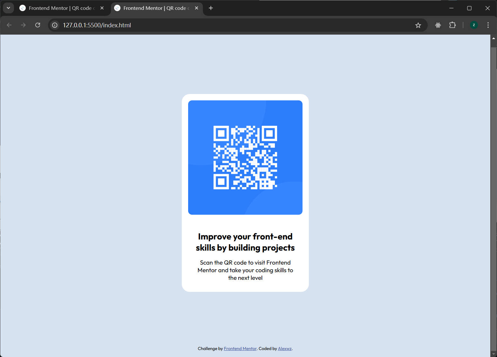

# Frontend Mentor - QR code component

## Welcome! 👋 My Name is Alex.

Thank You for checking my first Challenge on frontendMentor Website.

## Target

Your challenge is to build out this QR code component and get it looking as close to the design as possible.

## The project deployed:

I have initialized my project as a public repository on [GitHub](hhttps://github.com/Alexwz89/01-qr-code-component).
you can creat a repo will make it easier to share your code with the community if you need help.
If you're not sure how to do this, [have a read-through of this Try Git resource](https://try.github.io/).

"# 01-qr-code-component"
